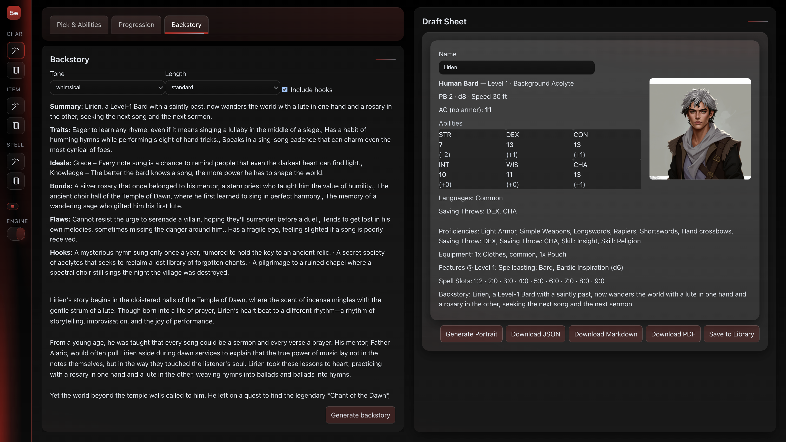
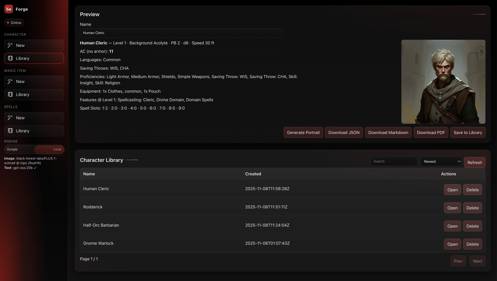

# 5e AI Character Forge

Generate playable D&D 5e characters with AI backstories, portraits, spells, and magic items. Local‑first by default, with a toggle between local inference and Google Gemini.

– API: http://localhost:8000
– Web: http://localhost:5173

**What it does**
- Character draft generator from 5e SRD (class, race, background, equipment, features, spell slots).
- Backstory generation (tone/length/hooks) via local LLM or Gemini.
- Portrait generation via local Diffusers (Flux) or Gemini image.
- Spell and Magic Item generators with a built‑in SQLite library and export to JSON/Markdown/PDF.
- One‑click exports and a searchable library of saved characters/items/spells.

**Stack**
- Backend: FastAPI + Uvicorn, SQLite (file `app.db`)
- Frontend: Vite + React + TypeScript (`web/`)
- Models: Local text (Ollama) + Local image (Diffusers/Flux) or Google Gemini

## Requirements
- Python 3.11+
- Node.js 18+
- npm
- macOS, Linux, or Windows (PowerShell 7+)
- Optional for local text: Ollama running on `http://localhost:11434` with a model like `gpt-oss:20b`
- Optional for local image: PyTorch + Diffusers (installed via `api/requirements.txt`); first image run will download model weights

## Quickstart

1) Copy env and (optionally) add your Google API key later
- `cp .env.example .env`
- By default, the app runs in local mode. The example does not include any Google API keys.

2) Start everything with the helper script
- macOS/Linux: `chmod +x run.sh` then `./run.sh`
- Windows (PowerShell 7+): `./run.ps1`

The script will:
- Create a Python venv and install `api/requirements.txt`
- Install frontend dependencies (`web/`)
- Launch FastAPI on `PORT_API` (default 8000)
- Launch Vite on `PORT_WEB` (default 5173)

Open the app at http://localhost:5173

## Running manually

Backend (API)
- Create venv: `python3 -m venv .venv`
- Activate: `source .venv/bin/activate` (macOS/Linux) or `.\.venv\Scripts\activate` (Windows)
- Install deps: `pip install -r api/requirements.txt`
- Start API: `uvicorn api.app.main:app --host 0.0.0.0 --port 8000 --reload`

Frontend (Web)
- `cd web`
- Install deps: `npm i`
- Ensure API port is visible to Vite (default uses `VITE_API_PORT=8000`)
- Dev server: `VITE_API_PORT=8000 npm run dev`

## Environment Variables
Copy `.env.example` to `.env`. The example matches the project’s current defaults but leaves Google keys blank.

Cloud (optional)
- `GOOGLE_API_KEY=`
- `GEMINI_MODEL_TEXT=gemini-2.5-pro`
- `GEMINI_MODEL_IMAGE=gemini-2.5-flash-image`

Local inference (default)
- `USE_LOCAL_INFERENCE=true` — default to local engine when the UI toggle is on “Local”
- Text (Ollama):
  - `LOCAL_LLM_URL=http://localhost:11434/api/generate`
  - `LOCAL_LLM_MODEL=gpt-oss:20b`
- Image (Diffusers/Flux):
  - `LOCAL_IMAGE_MODEL=black-forest-labs/FLUX.1-schnell`
  - `LOCAL_IMAGE_STEPS=4`
  - `LOCAL_IMAGE_GUIDANCE=0.0`
  - `LOCAL_IMAGE_SEED=42`
  - `LOCAL_IMAGE_WIDTH=0`
  - `LOCAL_IMAGE_HEIGHT=0`
- Platform hint:
  - `PYTORCH_ENABLE_MPS_FALLBACK=1` (prefer MPS on macOS; CPU fallback not forced)

General
- `LOG_LEVEL=INFO`
- `RULES_BASE_URL=https://www.dnd5eapi.co`
- `RULES_API_PREFIX=api/2014`
- `PORT_API=8000`
- `PORT_WEB=5173`

Frontend
- `VITE_API_PORT=8000` — web app uses this to reach the API
- `VITE_GOOGLE_API_KEY=` — optional; only enables the Quick backstory button by default

Notes
- The example `.env` intentionally leaves `GOOGLE_API_KEY` and `VITE_GOOGLE_API_KEY` blank.
- If you set `GOOGLE_API_KEY`, you can toggle the engine in the UI sidebar to “Google”.

## Local Inference Setup

Local Text (Ollama)
- Install Ollama: https://ollama.com
- Pull a model (example): `ollama pull gpt-oss:20b`
- Ensure Ollama is running on `http://localhost:11434`
- Adjust `LOCAL_LLM_MODEL` as desired (e.g., `llama3.1`, `qwen2.5` etc.).

Local Image (Diffusers/Flux)
- Installed via `api/requirements.txt`.
- First image generation will download weights for `black-forest-labs/FLUX.1-schnell` (several GB). This may take time.
- On macOS, MPS is used when available; CUDA is used on supported GPUs; otherwise CPU.

## Using the App

- Sidebar → Engine toggle: choose “Local” (default) or “Google”.
- Character
  - Roll abilities, pick class/race/background, auto‑assign ability order per class.
  - Generate draft: features, equipment, language, speed, basic AC, and spell slots (when applicable).
  - Generate backstory: select tone/length/hooks. Requires the selected engine to support text.
  - Portrait: generate via local Diffusers or Gemini image.
  - Export: JSON, Markdown, or PDF.
  - Save to Library: stored in `app.db` with optional portrait.
- Magic Items / Spells
  - Generate from high‑level prompts and parameters.
  - Save to library, search/sort, export to JSON/Markdown/PDF (items).

## Data Storage
- SQLite file: `app.db` at the project root.
- Tables: `library` (characters), `item_library`, `spell_library`.

## Troubleshooting
- API fails to start
  - Ensure Python 3.11+ and `pip install -r api/requirements.txt` completed successfully.
- Local text generation errors
  - Confirm Ollama is running and the model in `LOCAL_LLM_MODEL` is available: `ollama list`.
- Local image generation errors
  - The first run downloads model weights; wait for completion.
  - On macOS, verify PyTorch MPS support; otherwise generation falls back to CPU.
- Ports already in use
  - Change `PORT_API`, `PORT_WEB`, and `VITE_API_PORT` in `.env`.
- 5e rules API rate or connectivity issues
  - The app proxies `https://www.dnd5eapi.co`; intermittent issues will affect class/race/background lookups.

## License
See `LICENSE`.
